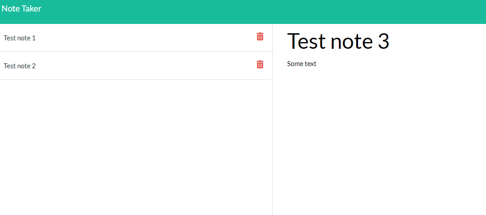

# Note Taker
  

  ## Description 
  
  This is an application that can be used to write, save and delete notes.  This application uses express backend and saves and retrieves notes from a JSON file.

  ## Table of Contents

  * [Installation](#Installation)
  * [Usage](#Usage)
  * [Questions](#Questions)
  
  ##  Installation

  none

  ## Usage

  Click the get started button on the home page, then it will take you to the /notes page where you can label your note with a title, and then enter in the text of your note.  Once you are satisfied with your note, hit the save button icon at the top right, and it will store the note  onto the JSON file, and display on the left side of your application.  If at any point you no longer need the note and wish to delete it, just hit the delete button icon on that specific note.

  ## Questions

  If you have any questions you can check out my github account: [Rseckman](https://github.com/Rseckman)
  or contact me at rseckman@hotmail.com